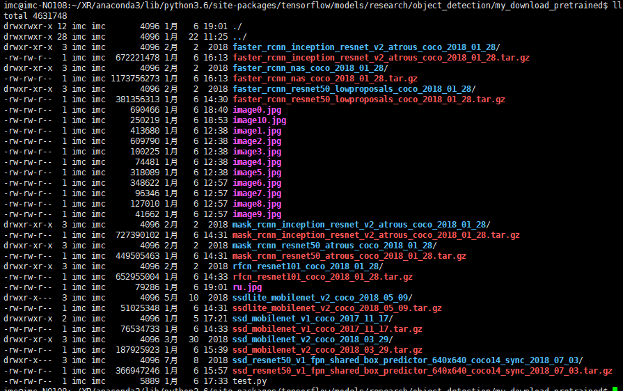
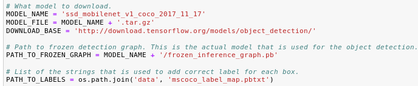
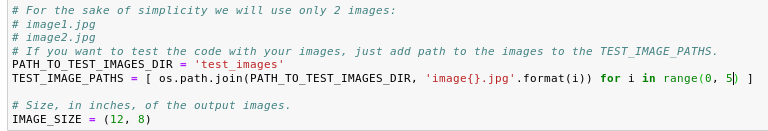
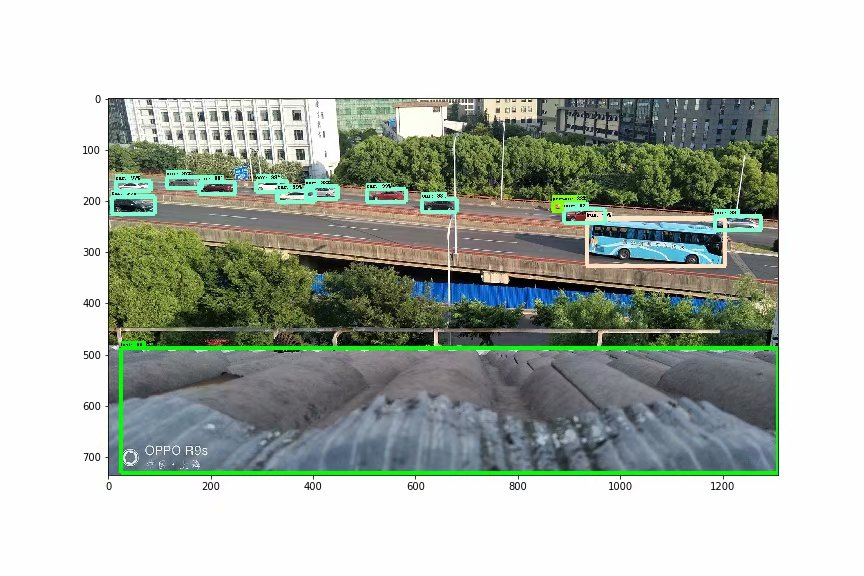
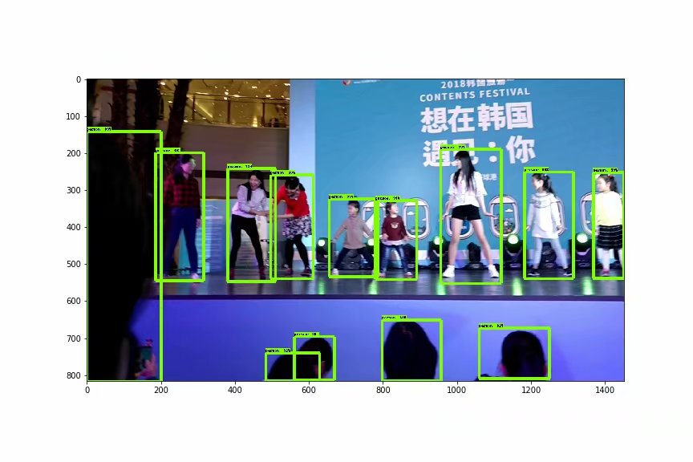
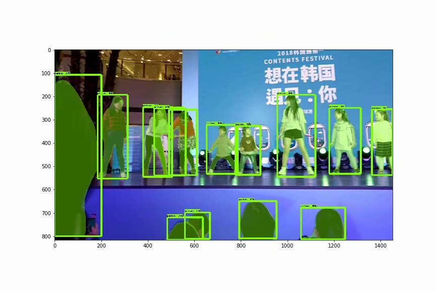

### Step1. Create a virtual environment and then operate in a virtual environment

```
conda create -n maskrcnn-benchmark python=3.6
source activate maskrcnn-benchmark
**If you want to uninstall the environment：conda remove -n maskrcnn-benchmark --all
```

### Step2.  Install

- ```
  You can see the effect map of the target detection on this URL:
  https://github.com/tensorflow/models/tree/master/research/object_detection
  ```

- ```
  download the zip: https://github.com/tensorflow/models
  and then follow the steps to install and according to this installation.md document
  ```

### Step3. After completing the installation according to the second step, you need to compile a few command lines.

```
Under the 'slim' and 'object_detection' folders,Under these two folders, we need to run two commands separately.
1. python setup.py build
2. python setup.py install
```

### Step4. Test, Run several models to check whether the installation is successful

```
This is my code in test.ipynb, you can find it in current folder
```

Let’s do it !!!

- This is my models directory, you can see that there are a lot of models I have downloaded.



- Run the jupyter notebook in the ‘object_detection’ folder

- You can change MODEL_NAME to specify a different model.

  

- Set your image here



- I ran several models, this is the result

  





