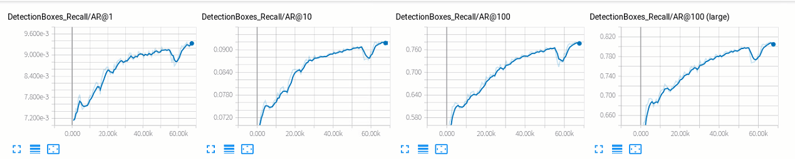

## **This is my project directory**


- Annotations——–Save my xml files
- data——————I put the csv file and the tfrecord file here.
- test_dataset——-Save my test datasets image
- train_images——-Save my training datasets image
- training————–I put the faster rcnn model files here


- train_labels———Save my txt files
- csv-txt.py————Generate  txt annotation file corresponding to the image from the csv file
- txt-xml.py————Generate  xml file corresponding to the image from the txt file
- xml-csv.py———–Generate  csv file  from the xml file
- generate_tfrecord.py——-Generate  tfrecord file  from the csv file

I actually put this file in the ‘research’ directory and run it in the ‘research’ directory.


## **Let's do it.!!!!!!!!!**

```
The datasets that I got was a csv file and a bunch of image,nothing more
you have seen the csv file in this form
```


## Step1. 

```
run csv-txt.py, the generated txt file is stored in the ‘train_labels’ folder.
```


## Step2.

```
run txt-xml.py, the generated xml file is stored in the ‘Annotations’ folder.
```

## Step3.

```
run xml-csv.py, the generated csv file is stored in the ‘data’ folder.
```


```
now, you have seen the csv file in this form
```


```
Cut about 1/3 of the datasets from the train_labels.csv file and save it to test_labels.csv  as a test datasets
```

## Step4.

```
Switch to the ‘research’ directory, and then….run model_csv_to_tfrecord.py, the generated tfrecord file is stored in the ‘data’ folder.
```

## Step5.

```
Switch to the ‘object detection’ directory, and then…..
```

1、training（The command to continue training is also this one.）

```
python model_main.py
 --pipeline_config_path=training/faster_rcnn_inception_resnet_v2_atrous_coco.config
--model_dir=training  --num_train_steps=60000  --num_eval_steps=20  --alsologtostderr
```

2、Visualization

```
tensorboard --logdir=training
```




```
It is obvious that the loss function is falling.
```

3、Export model(To export the model, simply modify the trained_checkpoint_prefix parameter, 2843 represents the number of iterations, and select the optimal model based on the loss function.)

```
python export_inference_graph.py --input_type image_tensor --pipeline_config_path training/faster_rcnn_inception_resnet_v2_atrous_coco.config --trained_checkpoint_prefix training/model.ckpt-2843 --output_directory generated_model
```

4、Testing(Exporting the model and then testing will generate a submission.csv file under the ‘object detection’directory.)

```
python object_detection_tutorial.py
```

