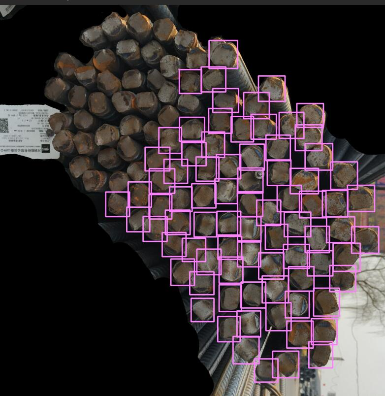
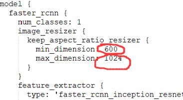
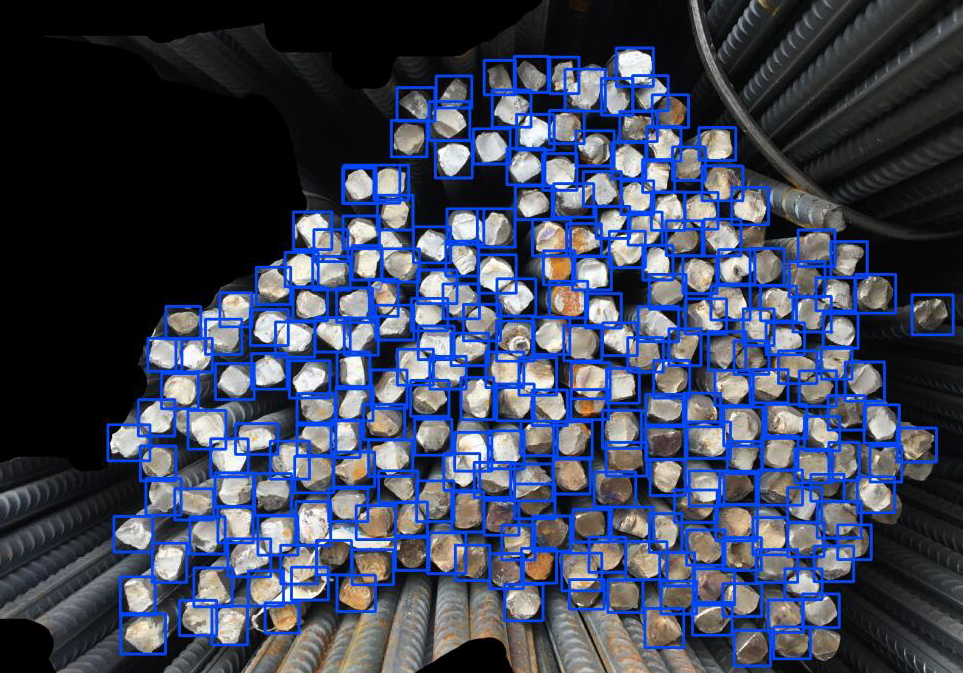

1.  1_install API.md————————————->1_install API/1_install API.md
2.  2_make my own datasets and training———>2_make my own datasets and training/2_make my own datasets and training.md

------

## Note:

Datasets trained by the **faster rcnn** model in this training. There was a strange phenomenon when testing with my own trained model. like…this

In fact, the effect is not bad, just one piece is not detected, very strange

By studying the source code of caffe on GitHub, I found that the source file has this setting.

I changed the configuration file code for the part of test , and then test, but it doesn’t work.  

Later I found that retraining worked.

The effect is not too bad, continue training

You can refer to my modified **.config file.**

