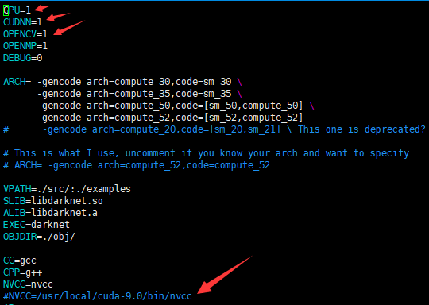

## The installation tutorial is very simple, you can refer to the official website for installation,  https://pjreddie.com/darknet/yolo/

- **this is, um….. I just sort out my ideas**

  

## **Let's do it.!!!!!!!!!**


## Step1. 

Configure the system environment and install some necessary packages

- cuda 
- opencv

## Step2. 

Execute the following commands in order

```
git clone https://github.com/pjreddie/darknet
cd darknet
make
wget https://pjreddie.com/media/files/yolov3.weights
./darknet detect cfg/yolov3.cfg yolov3.weights data/dog.jpg
```

If everything goes well here, you will see the test results, indicating that the program can run through, just use cpu

## Step3.

Open the ‘Makefile’ file, change these parameters



and then make again

## Step4.

Execute the command line to view the results.

```
./darknet detect cfg/yolov3.cfg yolov3.weights data/dog.jpg
./darknet detect cfg/yolov3.cfg yolov3.weights data/dog.jpg -thresh 0.2  # you can change the thresh value
```

## Step5.

About the training

Download initial weight file:     

```
wget https://pjreddie.com/media/files/darknet53.conv.74
```

Now we can train! Run the command:   

```
./darknet detector train cfg/voc.data cfg/yolov3-voc.cfg darknet53.conv.74
```

If you want to use multiple gpus run:

```
./darknet detector train cfg/coco.data cfg/yolov3.cfg darknet53.conv.74 -gpus 0,1,2,3
```

If you want to stop and restart training from a checkpoint:

```
./darknet detector train cfg/coco.data cfg/yolov3.cfg backup/yolov3.backup -gpus 0,1,2,
```

If you want to save the training log file for later visualization

```
./darknet detector train cfg/coco.data cfg/yolov3.cfg darknet53.conv.74 -gpus 0,1,2,3 | tee yolo.txt
```

