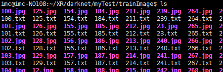

## General introduction

This is my darknet directory, lol……a bit messy, so…. I hide part of it and….you only see these darknet files.


I will introduce some files that need to be changes during training.

------


- myTest: This is my project folder


Note: .jpg and .txt need to be placed in same folder



note: trainImg_list.txt: This file stores the path of training image, don’t put txt path in it.


------

Under the cfg folder

- This is .data file

   

  ```
    classes: Set the number of your training categories
  
     train: the path of trainImg_list.txt
  
     names: the path of your .names file
  
     backup: Store the generated weight file
  ```

  


- This is yolov3.cfg file

  ```
  When we training our datasets, We can change the value of these parameters according to our needs.
  batch & subdivisions: Their values are related to our graphics card size, you can change the value according to your graphics card size
  width & height:This value is adjusted according to the size of the image that you want to train.(Must be a multiple of 13)
  learning_rate: Usually at the beginning of the training, we will set this value a little larger, then we will change it a little smaller.
  max_batches: When the number of iterations reaches this value, end of training. In fact, we will observe various values such as loss, IOU, etc. in the training, as well as the rendering of the intermediate test, manually terminate the training when appropriate.
  steps: You can set several values,When each value is reached, the learning rate is automatically adjusted.
  ```

  


```
classes: Set the number of your training categories
filters: The convolution layer above the yolo layer need to be changed. filters=(classes+5)*3
anchors: These values need to be changed when you have changed your width & heigh of images.
Note: in this .cfg file,Both classes and filters need to change three values
```


------

Under the cfg folder:

-   This is .names file: Fill in your classes name


## **Let's do it.!!!!!!!!!**

## Step1. ‘labelImg’

We need one Image annotation tool, which is called ‘labelImg’, you can easily download it on the website.

 Regarding its instructions for use, there are a lot of blogs on the Internet for reference. This is very simple, I won't go into details.

## Step2. del_single_xmlORtxt.py

First put all the .jpg and .xml files in the same folder. The reason why we put both .jpg and xml in a folder is because we want to check if all .jpg has a corresponding xml.

**Please run del_single_xmlORtxt.py**, Its function is to delete single .jpg if it does not have a corresponding .xml, or if .xml does not have a corresponding .jpg. Finally, the files are paired under the folder.

Then…… separate the .jpg and .xml files, respectively, in the ‘Annotations’ and ‘train_images’ files.

## Step3. generate_imgPath.py

**run generate_imgPath.py**, Write all .jpg paths to a .txt file

## Step4. xml-txt.py

After the step1, we have got the xml file for all images.

run xml-txt.py: convert xml format file to txt format

## Step5.

Change the value of these parameters by referring to the General introduction

- These must be changed: 

  ```
  in .cfg file: classes, filters, make sure batch & subdivisions are not commented
  Modify .data file
  Modify .names file
  ensure .jpg and .txt are placed in same folder
  ```

  

- These parameters can be modified according to the actual situation.

   in .cfg file: batch & subdivisions, width & height, learning_rate, max_batches, steps, …etc.

## Step6.

- If you have not changed the width and height values, you can skip this step.

- If you change the width and height, you need to recluster to generate an anchor, replacing the value of the anchor in cfg.

  ```
  run get_anchor.py
  ```

  

## Step7. training

The path of .data file and .cfg file needs to be specified by you.


## Step8. Visualization

The premise is that you have saved the log file when you are training. 

That is, add ‘| tee mylog.txt’ to the training command line.

```
./darknet detector train cfg/coco.data cfg/yolov3.cfg darknet53.conv.74 -gpus 0,1,2,3 | tee mylog.txt
```

and then….We will visualize the mylog.txt file

```
Regarding the visualization of yolo, I have to talk about it separately, please go to the 'visualization' folder.
```

## Step8. Test

- For testing, you can refer to my yolov3.py, because I changed it many times according to my own needs, and it was very messy lol……….

- Of course, you can also run the command line to see the effect.

```
Detect one image: ./darknet detect cfg/yolov3.cfg backup/yolov3_final.weights python/validateImage/817.jpg
```

