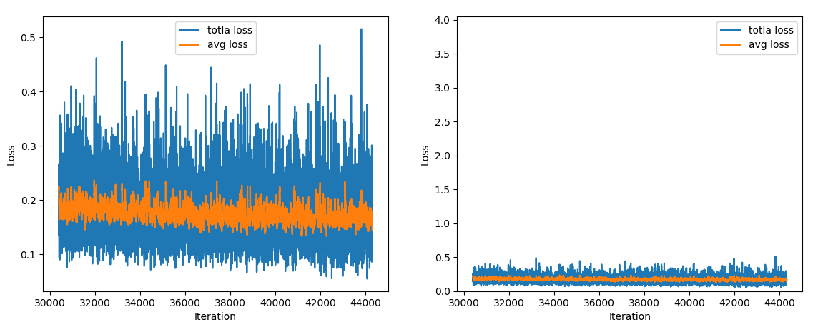
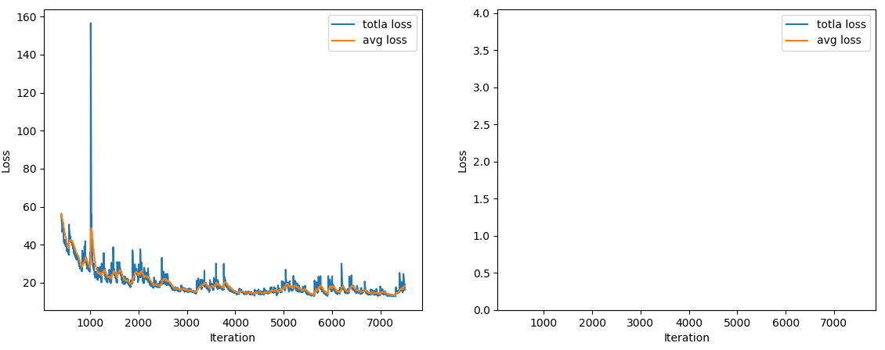

## I take my own log training log file for example. The effect of training may not be very good. I just use it to explain the specific operation.

- ## run show_loss.py

```
The picture on the left is the overall loss curve. 

The graph on the right is the curve of loss in the 0-4 interval.
```

The picture below is a visualization of one of my logs.



The picture below is my other log.txt file visualization. 

Since the loss curve has not fallen below 4, the image on the right is empty.



